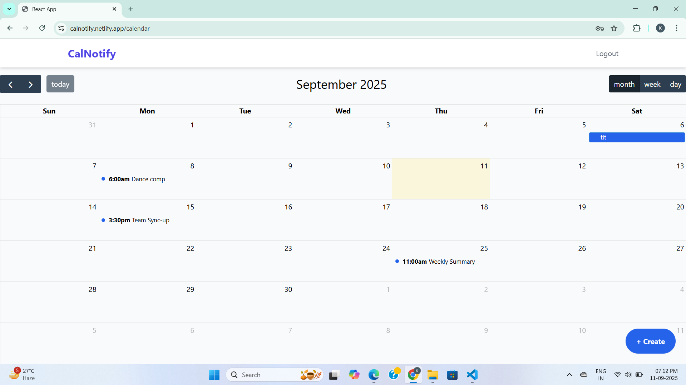
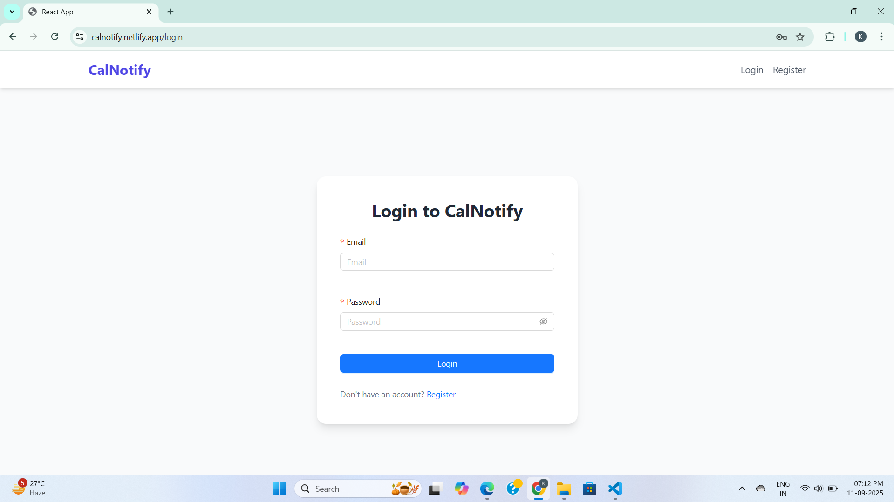
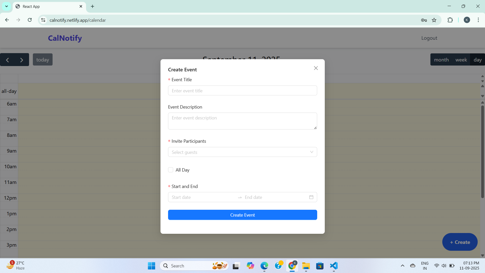
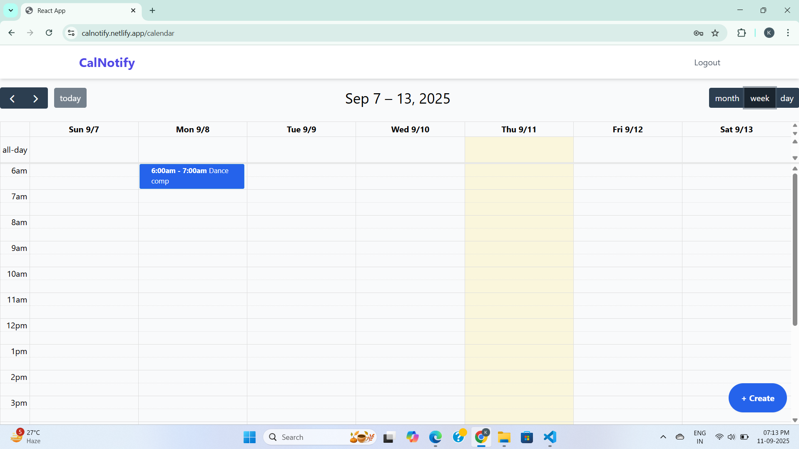
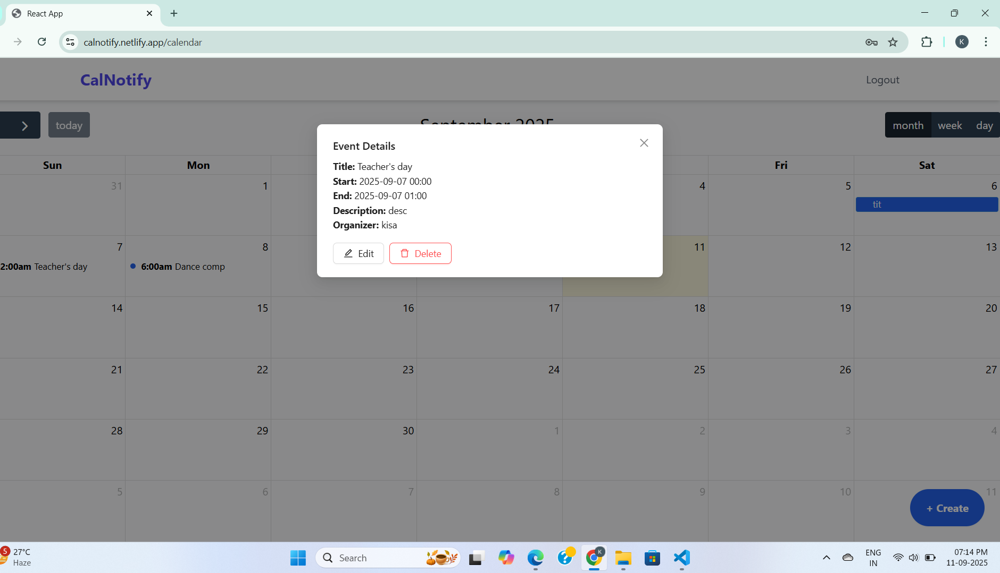

# 📅 CalNotify - Full Stack Calendar Application   

CalNotify is a **production-ready full-stack calendar application** built with  
**React (TypeScript)**, **Spring Boot (Java)**, and **MongoDB**.  
It enables users to **create, edit, delete, and share events** with email notifications and secure authentication.  

🔗 **Live Demo**: [https://calnotify.netlify.app](https://calnotify.netlify.app)  

---

## 🚀 Key Features  
- 🔐 **User Authentication** – Secure JWT-based login and role-based access.  
- 📆 **Calendar Management** – Create, edit, and delete events with day/week/month views.  
- 📧 **Email Notifications** – Send invitations for events.  
- 🔒 **Protected Routes** – Authenticated access control for sensitive pages.  
- ⚙️ **CI/CD Deployment** – Auto-deployed via GitHub Actions to **Netlify** (frontend) & **Railway** (backend).
-  🐳 **Dockerized Setup** – Easy one-command local setup. 
- 🎨 **Modern UI** – Built with Ant Design & FullCalendar for a polished experience.

---

## 🛠️ Tech Stack  

| Layer          | Technology                                |
|----------------|-------------------------------------------|
| Frontend       | React, TypeScript, Ant Design             |
| Backend        | Spring Boot, Java                        |
| Database       | MongoDB                                  |
| Authentication | JWT                                       |
| Deployment     | Netlify (Frontend), Railway (Backend)      |
|Container       |Docker, Docker Compose                     |

---

## 🖼️ Screenshots  

| Calendar | Login | Event Details |
|----------|-------|---------------|
|  |  |  |

| Week View | Detailed Event |
|-----------|----------------|
|  |  |

---

## 🎯 Why CalNotify?  
This project demonstrates my ability to:  
- Architect and build **full-stack applications** with a focus on security and scalability.  
- Implement **end-to-end CI/CD pipelines** with zero-downtime deployment.  
- Design an **intuitive frontend** with TypeScript and React.  
- Integrate **email services** and real-world workflows.
- Use **Docker for containerized development**. 
- Deliver a **production-ready app** deployed on the cloud.  

---

## 📥 Setup

```bash
git clone https://github.com/kisahasanzaidi/calnotify.git
cd calnotify

# Frontend setup
cd frontend && npm install && npm start

# Backend setup
cd backend && mvn clean install && ./mvn spring-boot:run


# frontend/.env
REACT_APP_API_URL =http://localhost:8080

# backend/src/main/resources/application.properties
spring.data.mongodb.uri=<your-mongodb-uri>
spring.mail.host=<your-email-smtp-host>
spring.mail.username=<your-email-username>
spring.mail.password=<your-email-password>
jwt.secret=<your-secret-key>


